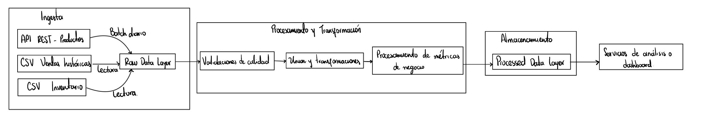

# Proyecto Parcial

## Descripción General

Este proyecto desarrolla un pipeline de datos para una startup de comercio electrónico que busca analizar las ventas y el inventario de productos tanto en tiempo real como de manera histórica. El objetivo principal es automatizar la ingesta, el procesamiento y el análisis de datos provenientes de diversas fuentes: una API REST que entrega productos actualizados, archivos CSV con registros históricos de ventas y datos de inventario local. El pipeline permite integrar estas fuentes, procesarlas de forma reproducible y obtener información clave como productos con stock crítico, ventas por categoría y rentabilidad estimada.

---

## Diagrama del Pipeline

---

## Justificación Técnica

### ¿Por qué diseño así el pipeline?

El pipeline que diseñe tiene una estructura modular y secuencial que refleja el flujo natural del ciclo de vida de los datos en un entorno de e-commerce. Inicialmente lo que tenemos es la fase de ingesta, que combina diferentes fuentes de información: una API REST que provee productos actualizados y dos archivos CSV que contienen las ventas históricas y el inventario local. Esta integración permite un análisis completo, combinando datos en tiempo real con datos históricos.  

Luego, se aplica una etapa de procesamiento y transformación en la que se limpian los datos, se realizan validaciones y se calculan métricas de negocio relevantes. Posteriormente, los resultados procesados se almacenan en una capa estructurada que facilita su consulta y análisis. Finalmente, los datos transformados se exponen a través de servicios de análisis o dashboards que permiten generar reportes de ventas, detectar productos con bajo stock y analizar la rentabilidad.  

Este diseño garantiza un flujo de datos claro, escalable y fácilmente mantenible, donde cada etapa cumple una función bien definida y puede ser mejorada o reemplazada sin afectar las demás.

---

### ¿Cómo garantiza la calidad de datos?

La calidad de los datos se asegura a través de un conjunto de verificaciones automáticas implementadas en la fase de procesamiento. Estas validaciones comprueban que los precios no sean negativos, que los valores de stock sean números enteros positivos, que las categorías existan y que las fechas de venta sean válidas.  

Además, el pipeline incluye un sistema de logging que registra cada ejecución y reporta errores o inconsistencias detectadas, lo que permite rastrear rápidamente el origen de un problema. El uso de formatos de almacenamiento estructurados como Parquet también contribuye a mantener la integridad y consistencia de la información. Con estas prácticas se busca garantizar que los datos que llegan a la capa de análisis sean confiables y representen correctamente la realidad del negocio.

---

### ¿Qué estrategia usaría para los versionamientos?

El control de versiones se maneja utilizando Git como herramienta central. Cada cambio en el código o en los archivos de configuración se documenta mediante commits atómicos con mensajes descriptivos que explican su propósito. Ademas podriamos trabajar con ramas separadas para desarrollo, pruebas y producción, lo que permite integrar nuevas funciones sin afectar la estabilidad del pipeline principal.  

El archivo de configuración en formato YAML también se versiona, de modo que cualquier modificación en rutas, parámetros o fuentes de datos quede registrada. Esto facilita reproducir versiones anteriores del pipeline o restaurar configuraciones específicas en caso de errores.

---

### ¿Cómo manejaría la escalabilidad?

La arquitectura propuesta está diseñada para escalar horizontalmente y adaptarse a distintos volúmenes de datos. La etapa de ingesta puede ejecutarse en paralelo, distribuyendo las fuentes en diferentes procesos o workers. A medida que aumente la carga de datos, el pipeline puede migrarse fácilmente a entornos cloud, utilizando servicios como AWS S3, GCP BigQuery o Azure Data Lake.  

El procesamiento de datos se optimiza mediante el uso de archivos Parquet, que reducen el tamaño de almacenamiento y mejoran la velocidad de lectura. Ademas, el orquestador implementado en Python podría integrarse con herramientas de mayor capacidad como Apache Airflow o Prefect para programar y monitorear las tareas de manera distribuida. De esta forma, el pipeline puede crecer en complejidad y volumen sin perder rendimiento.

---

## Test

---